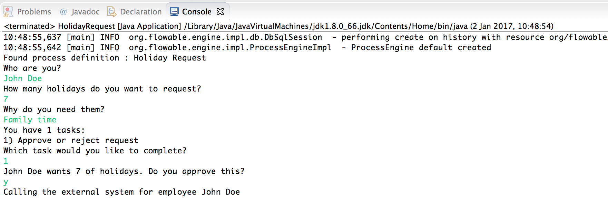

# 2. 入门
## 2.1. 什么是Flowable？
Flowable是一个使用Java编写的轻量级业务流程引擎。Flowable流程引擎让你可以部署BPMN 2.0流程定义（用于定义流程的行业XML标准），创建这些流程定义的流程实例，进行查询，访问运行中或历史的流程实例和相关数据等等。本章节将用一个可以在你自己的开发环境中使用的例子，逐步介绍各种概念与API。

Flowable可以十分灵活地加入你的应用/服务/构架。可以将JAR形式发布的Flowable库加入应用或服务，来嵌入引擎。以JAR形式发布使Flowable可以轻易加入任何Java环境：Java SE；Tomcat、Jetty或Spring之类的servlet容器；JBoss或WebSphere之类的Java EE服务器，等等。另外，也可以使用Flowable REST API通过HTTP通信。也有许多Flowable应用（Flowable Modeler, Flowable Admin, Flowable IDM 与 Flowable Task），提供了直接可用的UI示例，可以使用流程与任务。

所有设置Flowable的方法的共同点是核心引擎，核心引擎可被看做是一组服务的集合，并暴露了管理与执行业务流程的API。下面的各种教程都以设置与使用核心引擎的介绍开始。后续章节都建立在之前章节中获取的知识之上。

 - 在第一部分展示了如何在可能的最简单的方式运行可流动：仅使用Java SE普通的Java主。这里将解释许多核心概念和API。
 - 将在可流动的REST API部分显示如何运行，并通过REST使用相同的API。
 - 将在可流动的应用部分，将指导您使用出的现成例子可流动的用户界面的基本知识。
## 2.2. Flowable和Activiti
Flowable是Activiti（Alfresco的注册商标）的一个分支。在以下所有部分中，您将注意到程序包名称，配置文件等使用flowable。
## 2.3. 构建命令行应用程序
### 2.3.1 创建流程引擎
在第一篇教程中，我们将构建一个简单的示例，演示如何创建Flowable流程引擎，介绍一些核心概念并演示如何使用API。屏幕截图显示了Eclipse，但任何IDE都可以运行。我们将使用Maven来获取Flowable依赖项并管理构建，但同样，任何替代方案也都有效（Gradle，Ivy等）。

我们要构建的示例是一个简单的假日请求过程：

 - 该员工询问了一些假期
 - 该经理批准或拒绝该请求
 - 我们将模仿在某些外部系统中注册请求，并向员工发送包含结果的电子邮件
 
 首先，我们通过File→New→Other→Maven Project创建一个新的Maven项目


在下一个屏幕中，我们检查创建一个简单的项目（跳过原型选择）


并填写一些'Group Id'和'Artifact id'：


我们现在有一个空的Maven项目，我们将添加两个依赖项：

 - Flowable流程引擎，它允许我们创建ProcessEngine对象并访问Flowable API。
 - 在这种情况下，内存数据库H2作为Flowable引擎需要一个数据库来存储执行和历史数据，同时运行流程实例。请注意，H2依赖项包括数据库和驱动程序。如果您使用其他数据库（例如，PostgresQL，MySQL等），则需要添加特定的数据库驱动程序依赖项。

将以下内容添加到pom.xml文件中：

```xml?linenums
<dependencies>
  <dependency>
    <groupId>org.flowable</groupId>
    <artifactId>flowable-engine</artifactId>
    <version>6.3.1</version>
  </dependency>
  <dependency>
    <groupId>com.h2database</groupId>
    <artifactId>h2</artifactId>
    <version>1.3.176</version>
  </dependency>
</dependencies>
```
如果由于某种原因未自动检索从属JAR，则可以右键单击项目并选择Maven→更新项目以强制手动刷新（但通常不需要这样做）。在项目中，在' Maven依赖项下，您现在应该看到可流动引擎和各种其他（传递）依赖项。
创建一个新的Java类并添加常规的Java main方法：
```java?linenums
package org.flowable;

public class HolidayRequest {

  public static void main(String[] args) {

  }

}
```
我们需要做的第一件事是实例化ProcessEngine实例。这是一个线程安全的对象，您通常只需在应用程序中实例化一次。一个流程引擎从创建ProcessEngineConfiguration实例，它允许您配置和调整设置的流程引擎。通常，ProcessEngineConfiguration是使用配置XML文件创建的，但是（如我们所做）您也可以通过编程方式创建它。ProcessEngineConfiguration需要的最小配置是与数据库的JDBC连接：
```java?linenums
package org.flowable;

import org.flowable.engine.ProcessEngine;
import org.flowable.engine.ProcessEngineConfiguration;
import org.flowable.engine.impl.cfg.StandaloneProcessEngineConfiguration;

public class HolidayRequest {

  public static void main(String[] args) {
    ProcessEngineConfiguration cfg = new StandaloneProcessEngineConfiguration()
      .setJdbcUrl("jdbc:h2:mem:flowable;DB_CLOSE_DELAY=-1")
      .setJdbcUsername("sa")
      .setJdbcPassword("")
      .setJdbcDriver("org.h2.Driver")
      .setDatabaseSchemaUpdate(ProcessEngineConfiguration.DB_SCHEMA_UPDATE_TRUE);

    ProcessEngine processEngine = cfg.buildProcessEngine();
  }

}
```
在上面的代码中，在第10行，创建了一个独立的配置对象。这里的'standalone'指的是引擎是完全自己创建和使用的（而不是，例如，在Spring环境中，你在那里使用SpringProcessEngineConfiguration类）。在第11到14行，传递到内存中H2数据库实例的JDBC连接参数。重要说明：请注意，此类数据库无法在JVM重新启动后继续存在。如果您希望数据是持久的，则需要切换到持久数据库并相应地切换连接参数。在第15行，我们将标志设置为true确保在JDBC参数指向的数据库中尚不存在数据库模式时创建数据库模式。或者，Flowable附带一组SQL文件，可用于手动创建包含所有表的数据库模式。

所述流程引擎对象然后使用此配置（第17行）创建。

你现在可以运行它。Eclipse中最简单的方法是右键单击类文件并选择Run As→Java Application：


应用程序运行没有问题，但是，除了显示未正确配置日志记录的消息之外，控制台中不显示任何有用信息：


Flowable在内部使用SLF4J作为其日志框架。对于此示例，我们将在SLF4j上使用log4j记录器，因此将以下依赖项添加到pom.xml文件中：

```xml?linenums
<dependency>
  <groupId>org.slf4j</groupId>
  <artifactId>slf4j-api</artifactId>
  <version>1.7.21</version>
</dependency>
<dependency>
  <groupId>org.slf4j</groupId>
  <artifactId>slf4j-log4j12</artifactId>
  <version>1.7.21</version>
</dependency>
```
Log4j需要一个属性文件进行配置。使用以下内容将log4j.properties文件添加到src / main / resources文件夹：

```xml?linenums
log4j.rootLogger = DEBUG，CA

log4j.appender.CA = org.apache.log4j.ConsoleAppender
log4j.appender.CA.layout = org.apache.log4j.PatternLayout
log4j.appender.CA.layout.ConversionPattern =％d {hh：mm：ss，SSS} [％t]％-5p％c％x  - ％m％n
```

重新运行该应用程序。您现在应该看到有关引擎启动的信息性日志记录以及在数据库中创建的数据库模式：


### 2.3.2. 部署流程定义

我们将构建的流程是一个非常简单的假期请求流程。Flowable引擎期望以BPMN 2.0格式定义流程，BPMN 2.0格式是业界广泛接受的XML标准。在Flowable术语中，我们将此视为流程定义。从流程定义中，可以启动许多流程实例。将流程定义视为许多流程执行的蓝图。在这种特殊情况下，流程定义定义了请求假期所涉及的不同步骤，而一个流程实例与一个特定员工的假期请求相匹配。

BPMN 2.0存储为XML，但它也有一个可视化部分：它以标准方式定义每个不同步骤类型（人工任务，自动服务调用等）的表示方式以及如何将这些不同的步骤连接到彼此。通过这种方式，BPMN 2.0标准允许技术人员和业务人员以双方都理解的方式交流业务流程。

我们将使用的流程定义如下：


这个过程应该是不言自明的，但为了清楚起见，让我们描述不同的位：

 - 我们假设通过提供一些信息来启动流程，例如员工姓名，请求的假期数量和描述。当然，这可以作为该过程中单独的第一步建模。但是，通过将其作为进程的输入数据，只有在发出实际请求时才会实际创建流程实例。在另一种情况下，用户可以在提交之前改变主意并取消，但流程实例现在将在那里。在某些情况下，这可能是有价值的信息（例如，请求已启动但未完成的次数），具体取决于业务目标。
 - 左侧的圆圈称为开始事件。它是流程实例的起点。
 - 第一个矩形是用户任务。这是人类用户必须执行的过程中的一个步骤。在这种情况下，经理需要批准或拒绝该请求。
 - 根据经理决定的内容，专用网关（带有十字的菱形）将流程实例路由到批准或拒绝路径。
 - 如果获得批准，我们必须在某个外部系统中注册该请求，然后再向原始员工发送一个用户任务，通知他们该决定。当然，这可以用电子邮件代替。
 - 如果被拒绝，将向员工发送一封电子邮件，通知他们。

通常，这样的流程定义使用可视化建模工具建模，例如Flowable Designer（Eclipse）或Flowable Modeler（Web应用程序）。

然而，在这里，我们将直接编写XML以熟悉BPMN 2.0及其概念。

与上图对应的BPMN 2.0 XML如下所示。请注意，这只是流程部分。如果您使用了图形建模工具，则基础XML文件还包含描述图形信息的可视化部分，例如流程定义的各个元素的坐标（所有图形信息都包含在XML 中的BPMNDiagram标记中） ，这是定义标签的子元素）。

将以下XML保存在src / main / resources文件夹中名为holiday-request.bpmn20.xml的文件中。

```xml?linenums
<?xml version="1.0" encoding="UTF-8"?>
<definitions xmlns="http://www.omg.org/spec/BPMN/20100524/MODEL"
  xmlns:xsi="http://www.w3.org/2001/XMLSchema-instance"
  xmlns:xsd="http://www.w3.org/2001/XMLSchema"
  xmlns:bpmndi="http://www.omg.org/spec/BPMN/20100524/DI"
  xmlns:omgdc="http://www.omg.org/spec/DD/20100524/DC"
  xmlns:omgdi="http://www.omg.org/spec/DD/20100524/DI"
  xmlns:flowable="http://flowable.org/bpmn"
  typeLanguage="http://www.w3.org/2001/XMLSchema"
  expressionLanguage="http://www.w3.org/1999/XPath"
  targetNamespace="http://www.flowable.org/processdef">

  <process id="holidayRequest" name="Holiday Request" isExecutable="true">

    <startEvent id="startEvent"/>
    <sequenceFlow sourceRef="startEvent" targetRef="approveTask"/>

    <userTask id="approveTask" name="Approve or reject request"/>
    <sequenceFlow sourceRef="approveTask" targetRef="decision"/>

    <exclusiveGateway id="decision"/>
	<sequenceFlow sourceRef="decision" targetRef="externalSystemCall">
      <conditionExpression xsi:type="tFormalExpression">
        <![CDATA[
          ${approved}
        ]]>
      </conditionExpression>
    </sequenceFlow>
    <sequenceFlow  sourceRef="decision" targetRef="sendRejectionMail">
      <conditionExpression xsi:type="tFormalExpression">
        <![CDATA[
          ${!approved}
        ]]>
      </conditionExpression>
    </sequenceFlow>

    <serviceTask id="externalSystemCall" name="Enter holidays in external system"
        flowable:class="org.flowable.CallExternalSystemDelegate"/>
    <sequenceFlow sourceRef="externalSystemCall" targetRef="holidayApprovedTask"/>
	<userTask id="holidayApprovedTask" name="Holiday approved"/>
    <sequenceFlow sourceRef="holidayApprovedTask" targetRef="approveEnd"/>

    <serviceTask id="sendRejectionMail" name="Send out rejection email"
        flowable:class="org.flowable.SendRejectionMail"/>
    <sequenceFlow sourceRef="sendRejectionMail" targetRef="rejectEnd"/>

    <endEvent id="approveEnd"/>

    <endEvent id="rejectEnd"/>

  </process>

</definitions>
```
第2行到第11行看起来有点令人生畏，但它与您在几乎所有流程定义中看到的相同。这是需要与BPMN 2.0标准规范完全兼容的样板材料。

每个步骤（在BPMN 2.0术语，活动中）都有一个id属性，在XML文件中为其提供唯一标识符。所有活动都可以有一个可选名称，当然，这增加了可视化图表的可读性。

的活动由一个连接的序列流，这是视觉图中的定向箭头。执行流程实例时，执行将在序列流之后从start事件流向下一个activity。

离开专用网关的序列流（带有X的菱形）显然是特殊的：两者都具有以表达式形式定义的条件（参见第25和32行）。当流程实例执行到达此网关时，将评估条件并采用解析为true的第一个条件。这就是这里的独家代表：只选择一个。当然，如果需要不同的路由行为，其他类型的网关也是可能的。

此处作为表达式写入的条件的格式为$ {approved}，这是$ {approved == true}的简写。批准的变量称为过程变量。甲过程变量是与过程实例存储在一起，并且可以在过程实例的生命周期过程中使用的数据的持久性位。在这种情况下，它确实意味着我们必须在流程实例中的某个点（当提交管理器用户任务时，或者在Flowable术语中，已完成）设置此流程变量，因为它不是在流程实例启动。

现在我们有了流程BPMN 2.0 XML文件，接下来我们需要将它部署到引擎中。部署流程定义意味着：

 - 流程引擎将XML文件存储在数据库中，因此可以在需要时检索它
 - 流程定义被解析为内部可执行对象模型，以便可以从中启动流程实例。

要将流程定义部署到Flowable引擎，请使用RepositoryService，可以从ProcessEngine对象中检索该RepositoryService。使用RepositoryService，通过传递XML文件的位置并调用deploy（）方法来实际执行它，从而创建新的Deployment：

```java?linenums
RepositoryService repositoryService = processEngine.getRepositoryService();
Deployment deployment = repositoryService.createDeployment()
  .addClasspathResource("holiday-request.bpmn20.xml")
  .deploy();
```

我们现在可以通过API查询引擎知道流程定义（并了解API）。这是通过RepositoryService创建一个新的ProcessDefinitionQuery对象来完成的。
```java?linenums
ProcessDefinition processDefinition = repositoryService.createProcessDefinitionQuery()
  .deploymentId(deployment.getId())
  .singleResult();
System.out.println("Found process definition : " + processDefinition.getName());
```
### 2.3.3 启动流程实例

我们现在将流程定义部署到流程引擎，因此可以使用此流程定义作为蓝图启动流程实例。

要启动流程实例，我们需要提供一些初始流程变量。通常，当通过自动触发进程时，您将通过呈现给用户的表单或通过REST API获取这些表单。在这个例子中，我们将保持简单，并使用java.util.Scanner类在命令行上简单地输入一些数据：
```java?linenums
Scanner scanner= new Scanner(System.in);

System.out.println("Who are you?");
String employee = scanner.nextLine();

System.out.println("How many holidays do you want to request?");
Integer nrOfHolidays = Integer.valueOf(scanner.nextLine());

System.out.println("Why do you need them?");
String description = scanner.nextLine();
```
接下来，我们可以通过RuntimeService启动流程实例。收集的数据作为java.util.Map实例传递，其中键是稍后将用于检索变量的标识符。使用密钥启动流程实例。此键与BPMN 2.0 XML文件中设置的id属性匹配，在本例中为holidayRequest。

（注意：除了使用密钥之外，有很多方法可以在以后学习启动流程实例）
```xml?linenums
<process id="holidayRequest" name="Holiday Request" isExecutable="true">
```

```java?linenums
RuntimeService runtimeService = processEngine.getRuntimeService();

Map<String, Object> variables = new HashMap<String, Object>();
variables.put("employee", employee);
variables.put("nrOfHolidays", nrOfHolidays);
variables.put("description", description);
ProcessInstance processInstance =
  runtimeService.startProcessInstanceByKey("holidayRequest", variables);
```
启动流程实例时，会创建执行并将其放入start事件中。从那里开始，此执行遵循用于管理员批准的用户任务的顺序流，并执行用户任务行为。此行为将在数据库中创建一个任务，以后可以使用查询找到该任务。用户任务是等待状态，引擎将停止执行任何进一步的操作，返回API调用。

### 2.3.4 Sidetrack：交易性
在Flowable中，数据库事务在保证数据一致性和解决并发问题方面起着至关重要的作用。当您进行Flowable API调用时，默认情况下，所有内容都是同步的，并且是同一事务的一部分。意思是，当方法调用返回时，将启动并提交事务。

启动流程实例时，从流程实例的开始到下一个等待状态将有一个数据库事务。在此示例中，这是第一个用户任务。当引擎到达此用户任务时，状态将持久保存到数据库，并且提交事务并返回API调用。

在Flowable中，当继续进程实例时，总会有一个数据库事务从先前的等待状态进入下一个等待状态。一旦持久化，数据可以在数据库中存在很长时间，甚至几年（如果必须的话），直到执行API调用以进一步获取流程实例。请注意，当流程实例处于等待状态时，不会消耗任何计算或内存资源，等待下一个API调用。

在此处的示例中，当第一个用户任务完成时，将使用一个数据库事务从用户任务通过专用网关（自动逻辑）直到第二个用户任务。或者直接到另一条路径的尽头。
### 2.3.5 查询和完成事务
在更现实的应用程序中，将有一个用户界面，员工和经理可以登录并查看他们的任务列表。通过这些，他们可以检查存储为流程变量的流程实例数据，并决定他们想要对任务执行的操作。在此示例中，我们将通过执行通常位于驱动UI的服务调用后面的API调用来模拟任务列表。

我们尚未为用户任务配置分配。我们希望第一个任务是将管理员组和第二个用户任务分配给假期的原始请求者。为此，请将candidateGroups属性添加到第一个任务：
```xml?linenums
<userTask id="approveTask" name="Approve or reject request" flowable:candidateGroups="managers"/>
```
和受让人属于第二个任务，如下所示。请注意，我们没有像上面的管理器值那样使用静态值，而是基于我们在流程实例启动时传递的流程变量的动态赋值：

```xml?linenums
<userTask id="holidayApprovedTask" name="Holiday approved" flowable:assignee="${employee}"/>
```
为了获得实际的任务列表，我们通过TaskService创建一个TaskQuery，并将查询配置为仅返回manager组的任务：
```java?linenums
TaskService taskService = processEngine.getTaskService();
List<Task> tasks = taskService.createTaskQuery().taskCandidateGroup("managers").list();
System.out.println("You have " + tasks.size() + " tasks:");
for (int i=0; i<tasks.size(); i++) {
  System.out.println((i+1) + ") " + tasks.get(i).getName());
}
```
使用任务标识符，我们现在可以获取特定的流程实例变量，并在屏幕上显示实际请求：

```java?linenums
System.out.println("Which task would you like to complete?");
int taskIndex = Integer.valueOf(scanner.nextLine());
Task task = tasks.get(taskIndex - 1);
Map<String, Object> processVariables = taskService.getVariables(task.getId());
System.out.println(processVariables.get("employee") + " wants " +
    processVariables.get("nrOfHolidays") + " of holidays. Do you approve this?");
```
如果你运行它，应该看起来像这样：


经理现在可以完成任务。实际上，这通常意味着用户提交表单。然后将表单中的数据作为流程变量传递。在这里，我们将通过传递带有已批准变量的地图来模仿这一点（名称很重要，因为稍后在序列流的条件中使用它！）当任务完成时：
```java?linenums
boolean approved = scanner.nextLine().toLowerCase().equals("y");
variables = new HashMap<String, Object>();
variables.put("approved", approved);
taskService.complete(task.getId(), variables);
```
该任务现在已完成，并且基于批准的过程变量选择离开专用网关的两个路径之一。

### 2.3.6. 编写JavaDelegate

还有一个难题的最后一部分：我们还没有实现自动逻辑，当请求被批准时将会执行。在BPMN 2.0 XML中，这是一项服务任务，它看起来如下：

```xml?linenums
<serviceTask id="externalSystemCall" name="Enter holidays in external system"
    flowable:class="org.flowable.CallExternalSystemDelegate"/>
```
实际上，这种逻辑可以是任何东西，从使用HTTP REST调用服务到执行组织几十年来一直使用的系统的遗留代码调用。我们不会在这里实现实际逻辑，只需记录处理。

创建一个新类（文件→新建→ Eclipse中的类），将org.flowable作为包名称填写，将CallExternalSystemDelegate作为类名称填写。使该类实现org.flowable.engine.delegate.JavaDelegate接口并实现execute方法：
```java?linenums
package org.flowable;

import org.flowable.engine.delegate.DelegateExecution;
import org.flowable.engine.delegate.JavaDelegate;

public class CallExternalSystemDelegate implements JavaDelegate {

    public void execute(DelegateExecution execution) {
        System.out.println("Calling the external system for employee "
            + execution.getVariable("employee"));
    }

}
```
当执行到达服务任务时，实例化并调用BPMN 2.0 XML中引用的类。

现在运行示例时，将显示日志记录消息，说明自定义逻辑确实已执行：



### 2.3.7 使用历史数据
选择使用Flowable等流程引擎的众多原因之一是它会自动存储所有流程实例的审计数据或历史数据。此数据允许创建丰富的报告，以深入了解组织的工作方式，瓶颈所在的位置等。

例如，假设我们想要显示到目前为止我们一直执行的流程实例的持续时间。为此，我们 从ProcessEngine获取HistoryService并为历史活动创建查询。在下面的代码段中，您可以看到我们添加了一些额外的过滤：

 - 只有一个特定流程实例的活动
 - 只有已完成的活动

结果也按结束时间排序，这意味着我们将按执行顺序获取它们。
```java?linenums
HistoryService historyService = processEngine.getHistoryService();
List<HistoricActivityInstance> activities =
  historyService.createHistoricActivityInstanceQuery()
   .processInstanceId(processInstance.getId())
   .finished()
   .orderByHistoricActivityInstanceEndTime().asc()
   .list();

for (HistoricActivityInstance activity : activities) {
  System.out.println(activity.getActivityId() + " took "
    + activity.getDurationInMillis() + " milliseconds");
}
```

再次运行示例，我们现在在控制台中看到类似的内容：
```xml
startEvent花了1毫秒
approveTask花了2638毫秒
决定花了3毫秒
externalSystemCall花了1毫秒
```
### 2.3.8 结论
本教程介绍了各种Flowable和BPMN 2.0概念和术语，同时还演示了如何以编程方式使用Flowable API。

当然，这只是旅程的开始。以下部分将深入介绍Flowable引擎支持的众多选项和功能。其他部分介绍了Flowable引擎可以设置和使用的各种方式，并详细描述了所有可能的BPMN 2.0构造。

## 2.4. Flowable REST API入门
### 2.4.1. 设置REST应用程序
从flowable.org网站下载.zip文件时，可以在wars文件夹中找到REST应用程序。您需要一个servlet容器，例如Tomcat，Jetty等，来运行WAR文件。

使用Tomcat时，步骤如下：

 - 下载并解压缩最新最好的Tomcat zip文件（从Tomcat网站中选择Core发行版）。
 - 将flowable-rest.war文件从解压缩的Flowable发行版的wars文件夹复制到解压缩的Tomcat文件夹的webapps文件夹中。
 - 在命令行上，转到Tomcat文件夹的bin文件夹。
 - 执行./catalina运行以启动Tomcat服务器。

在服务器启动期间，您会注意到一些Flowable日志消息传递。最后，一条消息如INFO [main] org.apache.catalina.startup.Catalina.start服务器启动xyz ms表示服务器已准备好接收请求。请注意，默认情况下使用内存中的H2数据库实例，这意味着数据将无法在服务器重新启动后继续存在。

在以下部分中，我们将使用cURL演示各种REST调用。默认情况下，所有REST调用都受基本身份验证保护。所有呼叫都使用带密码测试的用户rest-admin。

启动后，通过执行验证应用程序是否正常运行
```
curl --user rest-admin:test http://localhost:8080/flowable-rest/service/management/engine
```
如果您返回正确的json响应，则REST API已启动并正在运行。

### 2.4.2. 部署流程定义
第一步是部署流程定义。使用REST API，可以通过将.bpmn20.xml文件（或多个流程定义的.zip文件）上传为multipart / formdata来完成：
```
curl --user rest-admin:test -F "file=@holiday-request.bpmn20.xml" http://localhost:8080/flowable-rest/service/repository/deployments
```
要验证是否正确部署了流程定义，可以请求流程定义列表：
```
curl --user rest-admin:test http://localhost:8080/flowable-rest/service/repository/process-definitions
```
它返回当前部署到引擎的所有流程定义的列表。
### 2.4.3. 启动流程实例
通过REST API启动流程实例类似于通过Java API执行相同操作：提供了一个密钥来标识要与初始流程变量映射一起使用的流程定义：
```
curl --user rest-admin:test -H "Content-Type: application/json" -X POST -d '{ "processDefinitionKey":"holidayRequest", "variables": [ { "name":"employee", "value": "John Doe" }, { "name":"nrOfHolidays", "value": 7 }]}' http://localhost:8080/flowable-rest/service/runtime/process-instances
```
返回类似的东西
```json?linenums
{"id":"43","url":"http://localhost:8080/flowable-rest/service/runtime/process-instances/43","businessKey":null,"suspended":false,"ended":false,"processDefinitionId":"holidayRequest:1:42","processDefinitionUrl":"http://localhost:8080/flowable-rest/service/repository/process-definitions/holidayRequest:1:42","activityId":null,"variables":[],"tenantId":"","completed":false}
```
### 2.4.4. 任务列表并完成任务
启动流程实例时，会将第一个任务分配给经理组。要获取该组的所有任务，可以通过REST API完成任务查询：

```
curl --user rest-admin:test -H "Content-Type: application/json" -X POST -d '{ "candidateGroup" : "managers" }' http://localhost:8080/flowable-rest/service/query/tasks
```
它返回管理员组的所有任务列表

现在可以使用以下方法完成此类任务：
```shell
curl --user rest-admin:test -H "Content-Type: application/json" -X POST -d '{ "action" : "complete", "variables" : [ { "name" : "approved", "value" : true} ]  }' http://localhost:8080/flowable-rest/service/runtime/tasks/25
```
但是，您很可能会收到如下错误：
```shell
{"message":"Internal server error","exception":"couldn't instantiate class org.flowable.CallExternalSystemDelegate"}
```
这意味着引擎无法找到服务任务中引用的CallExternalSystemDelegate类。要解决这个问题，需要将类放在应用程序的类路径上（这需要重新启动）。按照本节中的描述创建类，将其打包为JAR，并将其放在Tomcat 的webapps文件夹下的flowable -rest文件夹的WEB-INF / lib文件夹中。
