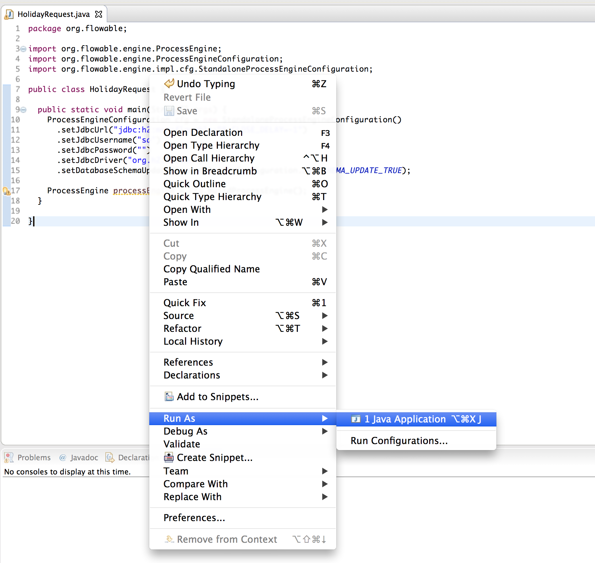

# 2. 入门
## 2.1. 什么是Flowable？
Flowable是一个用Java编写的轻量级业务流程引擎。Flowable流程引擎允许您部署BPMN 2.0流程定义（用于定义流程的行业XML标准），创建流程定义的流程实例，运行查询，访问活动或历史流程实例和相关数据等等。本节将逐步介绍各种概念和API，通过您可以在自己的开发机器上遵循的示例来实现。

Flowable在将其添加到您的应用程序/服务/体系结构时非常灵活。您可以通过包含Flowable库（可用作JAR）将引擎嵌入到您的应用程序或服务中。由于它是JAR，因此您可以轻松地将其添加到任何Java环境中：Java SE; servlet容器，如Tomcat或Jetty，Spring; Java EE服务器，例如JBoss或WebSphere等。或者，您可以使用Flowable REST API通过HTTP进行通信。还有几个Flowable应用程序（Flowable Modeler，Flowable Admin，Flowable IDM和Flowable Task），它们提供了用于处理流程和任务的开箱即用的示例UI。

设置Flowable的所有方法的共同点是核心引擎，可以将其视为公开API以管理和执行业务流程的服务集合。下面的各种教程首先介绍如何设置和使用这个核心引擎。之后的部分建立在前面部分中获得的知识之上。

 - 在第一部分展示了如何在可能的最简单的方式运行可流动：仅使用Java SE普通的Java主。这里将解释许多核心概念和API。
 - 将在可流动的REST API部分显示如何运行，并通过REST使用相同的API。
 - 将在可流动的应用部分，将指导您使用出的现成例子可流动的用户界面的基本知识。
## 2.2. Flowable和Activiti
Flowable是Activiti（Alfresco的注册商标）的一个分支。在以下所有部分中，您将注意到程序包名称，配置文件等使用flowable。
## 2.3. 构建命令行应用程序
### 2.3.1 创建流程引擎
在第一篇教程中，我们将构建一个简单的示例，演示如何创建Flowable流程引擎，介绍一些核心概念并演示如何使用API。屏幕截图显示了Eclipse，但任何IDE都可以运行。我们将使用Maven来获取Flowable依赖项并管理构建，但同样，任何替代方案也都有效（Gradle，Ivy等）。

我们要构建的示例是一个简单的假日请求过程：

 - 该员工询问了一些假期
 - 该经理批准或拒绝该请求
 - 我们将模仿在某些外部系统中注册请求，并向员工发送包含结果的电子邮件
 
 首先，我们通过File→New→Other→Maven Project创建一个新的Maven项目


在下一个屏幕中，我们检查创建一个简单的项目（跳过原型选择）


并填写一些'Group Id'和'Artifact id'：



我们现在有一个空的Maven项目，我们将添加两个依赖项：

 - Flowable流程引擎，它允许我们创建ProcessEngine对象并访问Flowable API。
 - 在这种情况下，内存数据库H2作为Flowable引擎需要一个数据库来存储执行和历史数据，同时运行流程实例。请注意，H2依赖项包括数据库和驱动程序。如果您使用其他数据库（例如，PostgresQL，MySQL等），则需要添加特定的数据库驱动程序依赖项。

将以下内容添加到pom.xml文件中：

```xml?linenums
<dependencies>
  <dependency>
    <groupId>org.flowable</groupId>
    <artifactId>flowable-engine</artifactId>
    <version>6.3.1</version>
  </dependency>
  <dependency>
    <groupId>com.h2database</groupId>
    <artifactId>h2</artifactId>
    <version>1.3.176</version>
  </dependency>
</dependencies>
```
如果由于某种原因未自动检索从属JAR，则可以右键单击项目并选择Maven→更新项目以强制手动刷新（但通常不需要这样做）。在项目中，在' Maven依赖项下，您现在应该看到可流动引擎和各种其他（传递）依赖项。
创建一个新的Java类并添加常规的Java main方法：
```java?linenums
package org.flowable;

public class HolidayRequest {

  public static void main(String[] args) {

  }

}
```
我们需要做的第一件事是实例化ProcessEngine实例。这是一个线程安全的对象，您通常只需在应用程序中实例化一次。一个流程引擎从创建ProcessEngineConfiguration实例，它允许您配置和调整设置的流程引擎。通常，ProcessEngineConfiguration是使用配置XML文件创建的，但是（如我们所做）您也可以通过编程方式创建它。ProcessEngineConfiguration需要的最小配置是与数据库的JDBC连接：
```java?linenums
package org.flowable;

import org.flowable.engine.ProcessEngine;
import org.flowable.engine.ProcessEngineConfiguration;
import org.flowable.engine.impl.cfg.StandaloneProcessEngineConfiguration;

public class HolidayRequest {

  public static void main(String[] args) {
    ProcessEngineConfiguration cfg = new StandaloneProcessEngineConfiguration()
      .setJdbcUrl("jdbc:h2:mem:flowable;DB_CLOSE_DELAY=-1")
      .setJdbcUsername("sa")
      .setJdbcPassword("")
      .setJdbcDriver("org.h2.Driver")
      .setDatabaseSchemaUpdate(ProcessEngineConfiguration.DB_SCHEMA_UPDATE_TRUE);

    ProcessEngine processEngine = cfg.buildProcessEngine();
  }

}
```
在上面的代码中，在第10行，创建了一个独立的配置对象。这里的'standalone'指的是引擎是完全自己创建和使用的（而不是，例如，在Spring环境中，你在那里使用SpringProcessEngineConfiguration类）。在第11到14行，传递到内存中H2数据库实例的JDBC连接参数。重要说明：请注意，此类数据库无法在JVM重新启动后继续存在。如果您希望数据是持久的，则需要切换到持久数据库并相应地切换连接参数。在第15行，我们将标志设置为true确保在JDBC参数指向的数据库中尚不存在数据库模式时创建数据库模式。或者，Flowable附带一组SQL文件，可用于手动创建包含所有表的数据库模式。

所述流程引擎对象然后使用此配置（第17行）创建。

你现在可以运行它。Eclipse中最简单的方法是右键单击类文件并选择Run As→Java Application：


应用程序运行没有问题，但是，除了显示未正确配置日志记录的消息之外，控制台中不显示任何有用信息：


Flowable在内部使用SLF4J作为其日志框架。对于此示例，我们将在SLF4j上使用log4j记录器，因此将以下依赖项添加到pom.xml文件中：

```xml?linenums
<dependency>
  <groupId>org.slf4j</groupId>
  <artifactId>slf4j-api</artifactId>
  <version>1.7.21</version>
</dependency>
<dependency>
  <groupId>org.slf4j</groupId>
  <artifactId>slf4j-log4j12</artifactId>
  <version>1.7.21</version>
</dependency>
```
Log4j需要一个属性文件进行配置。使用以下内容将log4j.properties文件添加到src / main / resources文件夹：

```xml?linenums
log4j.rootLogger = DEBUG，CA

log4j.appender.CA = org.apache.log4j.ConsoleAppender
log4j.appender.CA.layout = org.apache.log4j.PatternLayout
log4j.appender.CA.layout.ConversionPattern =％d {hh：mm：ss，SSS} [％t]％-5p％c％x  - ％m％n
```

重新运行该应用程序。您现在应该看到有关引擎启动的信息性日志记录以及在数据库中创建的数据库模式：


### 2.3.2. 部署流程定义

我们将构建的流程是一个非常简单的假期请求流程。Flowable引擎期望以BPMN 2.0格式定义流程，BPMN 2.0格式是业界广泛接受的XML标准。在Flowable术语中，我们将此视为流程定义。从流程定义中，可以启动许多流程实例。将流程定义视为许多流程执行的蓝图。在这种特殊情况下，流程定义定义了请求假期所涉及的不同步骤，而一个流程实例与一个特定员工的假期请求相匹配。

BPMN 2.0存储为XML，但它也有一个可视化部分：它以标准方式定义每个不同步骤类型（人工任务，自动服务调用等）的表示方式以及如何将这些不同的步骤连接到彼此。通过这种方式，BPMN 2.0标准允许技术人员和业务人员以双方都理解的方式交流业务流程。

我们将使用的流程定义如下：


这个过程应该是不言自明的，但为了清楚起见，让我们描述不同的位：

 - 我们假设通过提供一些信息来启动流程，例如员工姓名，请求的假期数量和描述。当然，这可以作为该过程中单独的第一步建模。但是，通过将其作为进程的输入数据，只有在发出实际请求时才会实际创建流程实例。在另一种情况下，用户可以在提交之前改变主意并取消，但流程实例现在将在那里。在某些情况下，这可能是有价值的信息（例如，请求已启动但未完成的次数），具体取决于业务目标。
 - 左侧的圆圈称为开始事件。它是流程实例的起点。
 - 第一个矩形是用户任务。这是人类用户必须执行的过程中的一个步骤。在这种情况下，经理需要批准或拒绝该请求。
 - 根据经理决定的内容，专用网关（带有十字的菱形）将流程实例路由到批准或拒绝路径。
 - 如果获得批准，我们必须在某个外部系统中注册该请求，然后再向原始员工发送一个用户任务，通知他们该决定。当然，这可以用电子邮件代替。
 - 如果被拒绝，将向员工发送一封电子邮件，通知他们。

通常，这样的流程定义使用可视化建模工具建模，例如Flowable Designer（Eclipse）或Flowable Modeler（Web应用程序）。

然而，在这里，我们将直接编写XML以熟悉BPMN 2.0及其概念。

与上图对应的BPMN 2.0 XML如下所示。请注意，这只是流程部分。如果您使用了图形建模工具，则基础XML文件还包含描述图形信息的可视化部分，例如流程定义的各个元素的坐标（所有图形信息都包含在XML 中的BPMNDiagram标记中） ，这是定义标签的子元素）。

将以下XML保存在src / main / resources文件夹中名为holiday-request.bpmn20.xml的文件中。

```xml?linenums
<?xml version="1.0" encoding="UTF-8"?>
<definitions xmlns="http://www.omg.org/spec/BPMN/20100524/MODEL"
  xmlns:xsi="http://www.w3.org/2001/XMLSchema-instance"
  xmlns:xsd="http://www.w3.org/2001/XMLSchema"
  xmlns:bpmndi="http://www.omg.org/spec/BPMN/20100524/DI"
  xmlns:omgdc="http://www.omg.org/spec/DD/20100524/DC"
  xmlns:omgdi="http://www.omg.org/spec/DD/20100524/DI"
  xmlns:flowable="http://flowable.org/bpmn"
  typeLanguage="http://www.w3.org/2001/XMLSchema"
  expressionLanguage="http://www.w3.org/1999/XPath"
  targetNamespace="http://www.flowable.org/processdef">

  <process id="holidayRequest" name="Holiday Request" isExecutable="true">

    <startEvent id="startEvent"/>
    <sequenceFlow sourceRef="startEvent" targetRef="approveTask"/>

    <userTask id="approveTask" name="Approve or reject request"/>
    <sequenceFlow sourceRef="approveTask" targetRef="decision"/>

    <exclusiveGateway id="decision"/>
	<sequenceFlow sourceRef="decision" targetRef="externalSystemCall">
      <conditionExpression xsi:type="tFormalExpression">
        <![CDATA[
          ${approved}
        ]]>
      </conditionExpression>
    </sequenceFlow>
    <sequenceFlow  sourceRef="decision" targetRef="sendRejectionMail">
      <conditionExpression xsi:type="tFormalExpression">
        <![CDATA[
          ${!approved}
        ]]>
      </conditionExpression>
    </sequenceFlow>

    <serviceTask id="externalSystemCall" name="Enter holidays in external system"
        flowable:class="org.flowable.CallExternalSystemDelegate"/>
    <sequenceFlow sourceRef="externalSystemCall" targetRef="holidayApprovedTask"/>
	<userTask id="holidayApprovedTask" name="Holiday approved"/>
    <sequenceFlow sourceRef="holidayApprovedTask" targetRef="approveEnd"/>

    <serviceTask id="sendRejectionMail" name="Send out rejection email"
        flowable:class="org.flowable.SendRejectionMail"/>
    <sequenceFlow sourceRef="sendRejectionMail" targetRef="rejectEnd"/>

    <endEvent id="approveEnd"/>

    <endEvent id="rejectEnd"/>

  </process>

</definitions>
```
第2行到第11行看起来有点令人生畏，但它与您在几乎所有流程定义中看到的相同。这是需要与BPMN 2.0标准规范完全兼容的样板材料。

每个步骤（在BPMN 2.0术语，活动中）都有一个id属性，在XML文件中为其提供唯一标识符。所有活动都可以有一个可选名称，当然，这增加了可视化图表的可读性。

的活动由一个连接的序列流，这是视觉图中的定向箭头。执行流程实例时，执行将在序列流之后从start事件流向下一个activity。

离开专用网关的序列流（带有X的菱形）显然是特殊的：两者都具有以表达式形式定义的条件（参见第25和32行）。当流程实例执行到达此网关时，将评估条件并采用解析为true的第一个条件。这就是这里的独家代表：只选择一个。当然，如果需要不同的路由行为，其他类型的网关也是可能的。

此处作为表达式写入的条件的格式为$ {approved}，这是$ {approved == true}的简写。批准的变量称为过程变量。甲过程变量是与过程实例存储在一起，并且可以在过程实例的生命周期过程中使用的数据的持久性位。在这种情况下，它确实意味着我们必须在流程实例中的某个点（当提交管理器用户任务时，或者在Flowable术语中，已完成）设置此流程变量，因为它不是在流程实例启动。

现在我们有了流程BPMN 2.0 XML文件，接下来我们需要将它部署到引擎中。部署流程定义意味着：

 - 流程引擎将XML文件存储在数据库中，因此可以在需要时检索它
 - 流程定义被解析为内部可执行对象模型，以便可以从中启动流程实例。

要将流程定义部署到Flowable引擎，请使用RepositoryService，可以从ProcessEngine对象中检索该RepositoryService。使用RepositoryService，通过传递XML文件的位置并调用deploy（）方法来实际执行它，从而创建新的Deployment：

```java?linenums
RepositoryService repositoryService = processEngine.getRepositoryService();
Deployment deployment = repositoryService.createDeployment()
  .addClasspathResource("holiday-request.bpmn20.xml")
  .deploy();
```

我们现在可以通过API查询引擎知道流程定义（并了解API）。这是通过RepositoryService创建一个新的ProcessDefinitionQuery对象来完成的。
```java?linenums
ProcessDefinition processDefinition = repositoryService.createProcessDefinitionQuery()
  .deploymentId(deployment.getId())
  .singleResult();
System.out.println("Found process definition : " + processDefinition.getName());
```
### 2.3.3 启动流程实例


## 2.4. Flowable REST API入门
